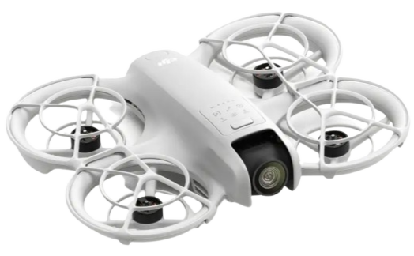

# EOLab's Drones

## Tutorials

The following is a set of tutorials that are common to all our drones, that means that all the steps and procedures described in these tutorials are applicable to all our drones platforms.
- [How to Flash Firmware](./firmware.md)
- [Mandatory Transmitter Settings](./transmitter.md)

## Catalog

| Drone Name | Quantity | Image                            | Brief                                                                | Documentaion                              |
|------------|:--------:|----------------------------------|----------------------------------------------------------------------|-------------------------------------------|
| SAR        | 1        |                                  |                                                                      | [SAR Docs](./sar/README.md)               |
| Platypus   | 1        |                                  | Dry weight:  payload capacity: Frame config: Octorotor Coaxial | [Platypus Docs](./platypus/README.md)     |
| Protoflyer | 1        |                                  |                                                                      | [Protoflyer Docs](./protoflyer/README.md) |
| Phoenix    | 1        |                                  |                                                                      | [Phoenix Docs](./phoenix/README.md)       |
| DJI NEO    | 1        |  |                                                                      | [DJI NEO Docs](./dji-neo/README.md)       |
