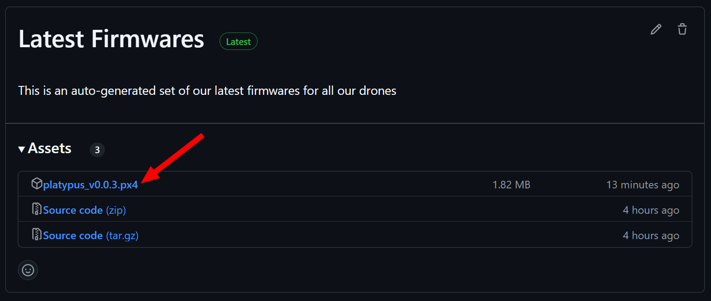
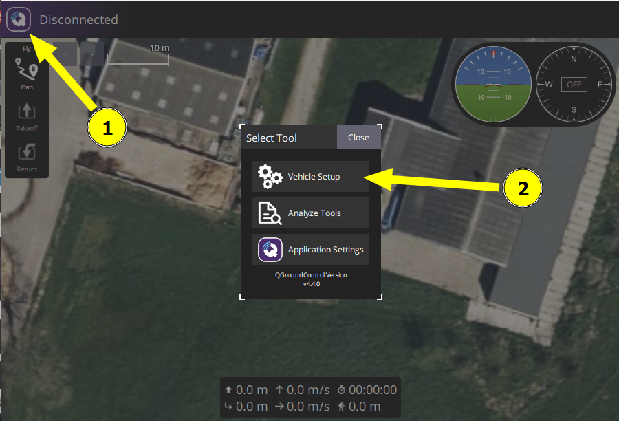
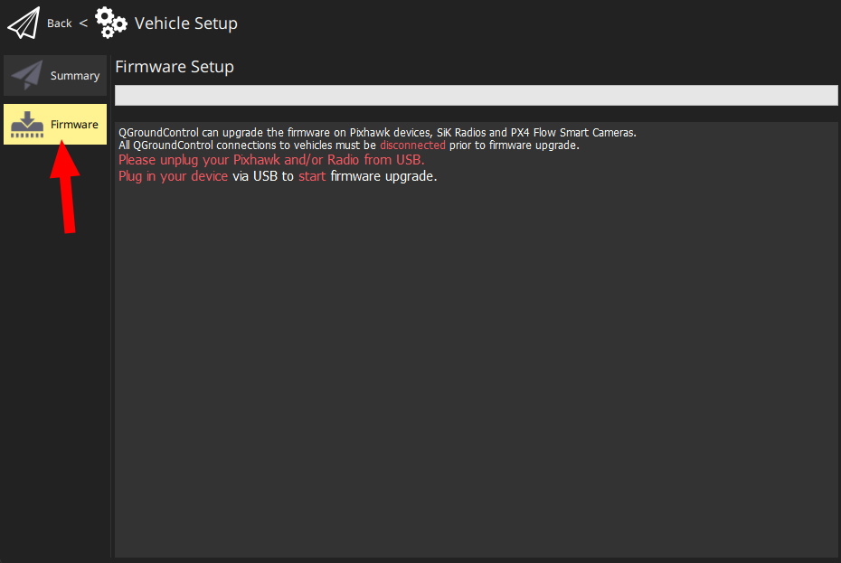
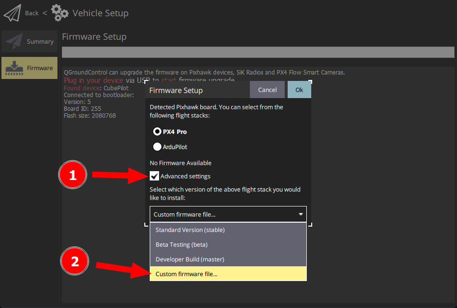
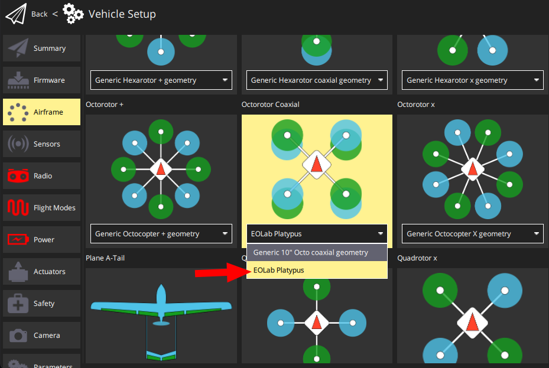

# Common Manual

The following **Common Manual** contains a series of instructions, notes and general information that applies to all of our drones with the self-build label (see our [catalog](https://drones.eolab.de/#catalog)), unless explicitly referenced as applying to all of our catalog.

[[toc]]

---

## How to Flash Firmware

1. **Download the latest firmware**: Based on your drone name, get the latest available firmware from our [releases](https://github.com/EOLab-HSRW/drones-fw/releases). *For example*: `platypus`, download the `platypus_VERSION.px4` firmware file:

2. Open [QGroundControl](https://qgroundcontrol.com/) by clicking on the upper left corner on the letter "Q" and select "Vehicle Setup".

3. Select the "Firmware" menu.

4. **Flash the firmware**: Connect the flight controller to your computer using USB cable and select "Advanced settings", from the dropdown menu pick "Custom firmware file" and upload the custom firmware downloaded from step (1).

5. **RESTART** QGroundControl.

6. Open the "Vehicle Setup" (as described in step 2) and go to menu "Airframe" and depending the drone frame configuration select your drone name on the list of frames, and finally click on the button "Apply and Restart". *For example*: `platypus` is a "Octorotor Coaxial", select the frame group for "Octorotor Coaxial" and from the dropdown menu select "EOLab Platypus".

Done.

## How to Charge the Batteries

## Planning a Campaign

- [Easy Access Rules for Unmanned Aircraft Systems (Regulations (EU))](https://www.easa.europa.eu/en/document-library/easy-access-rules/easy-access-rules-unmanned-aircraft-systems-regulations-eu)

Check our template format for planning campaigns: [Mission Planning (template)](https://docs.google.com/document/d/1gdN9ebnTEY66zqJBIfyZLmIBJGGOQ38saH6_vEyxmEk/edit?usp=sharing)

## Flight Modes

## Transmitter Settings

> [!IMPORTANT]
> The radio transmitter must be set to `Mode 2`. For more information on the differences between `Mode 1` and `Mode 2` see [Types of Remote Controllers - PX4 Docs](https://docs.px4.io/main/en/getting_started/rc_transmitter_receiver.html#types-of-remote-controllers)

| RC Channel | Function           | Description                                                        |
|:----------:|--------------------|--------------------------------------------------------------------|
| 1          | Roll               | Manual control                                                     |
| 2          | Pitch              | Manual control                                                     |
| 3          | Throttle           | Manual control                                                     |
| 4          | Yaw                | Manual control                                                     |
| 5          | Offboard Mode      | Enables Offboard Mode on the flight controller                     |
| 6          | Flight mode switch | Changes the flight mode. Only for manual flights.                  |
| 7          | reserved           | reserved                                                           |
| 8          | Kill Switch        | ⚠️ Emergency Stop. The drone can fall from the sky if you use this. |

## Flight Modes

| (Physical) Switch Position | Mode                                                                  |
|:--------------------------:|-----------------------------------------------------------------------|
| 1                          | [Position](https://docs.px4.io/main/en/flight_modes_mc/position.html) |
| unassigned                 | [Offboard](https://docs.px4.io/main/en/flight_modes/offboard)         |

For more information check the PX4 documentation for [flight modes](https://docs.px4.io/main/en/flight_modes_mc/).
