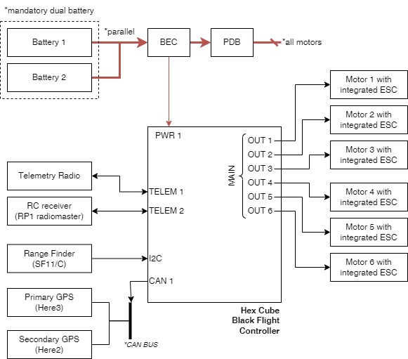

# Condor

## Specs

|                                                 |                                     |
|-------------------------------------------------|-------------------------------------|
| Airframe configuration                          | Hexarotor X                         |
| Wheelbase diameter                              | 1.61 m                              |
| Dry weight*                                     | 13.4 kg                             |
| Payload Capacity                                | 20 kg                               |
| Number of motors                                | 6                                   |
| Total recommended thrust (at 12S 100% throttle) | 42 kfg (calculated from motor spec) |
| Max. Total thrust (at 12S 100% throttle)        | 91 kfg (calculated from motor spec) |
| Number of batteries                             | 2                                   |
| Battery voltage                                 | 12S (x2 parralel)                   |
| Battery capacity                                | 16000 mAh                           |
| Individual battery weight                       | 4.8 kg                              |

*: Drone's weight without battery or payloads

## Components

| Component   | Model                                                                                                                      | Documentation                                                                                                    |
|-------------|----------------------------------------------------------------------------------------------------------------------------|------------------------------------------------------------------------------------------------------------------|
| FMU         | [Hex Cube Black](https://docs.px4.io/main/en/flight_controller/pixhawk-2.html)                                             | [The Cube Module Overview](https://docs.cubepilot.org/user-guides/autopilot/the-cube-module-overview)            |
| Motor       | [Hobbywing X8](https://www.hobbywing.com/en/products/xrotor-x8108)                                                         | [User Manual](https://robu.in/wp-content/uploads/2023/08/x8-manual.pdf)                                          |
| ESC         | Integrated as part of the motor. See motor user manual for more info.                                                      | [User Manual](https://robu.in/wp-content/uploads/2023/08/x8-manual.pdf)                                          |
| Props       | 29 Inch foldable prop                                                                                                      | [User Manual](https://robu.in/wp-content/uploads/2023/08/x8-manual.pdf)                                          |
| Rangefinder | [SF11/C](https://lightwarelidar.com/shop/sf11-c-100-m/) up to 100 meter range                                              | [Product Manual](https://www.documents.lightware.co.za/SF11%20-%20Laser%20Altimeter%20Manual%20-%20Rev%2010.pdf) |
| BEC         | [PM08-CAN 14S 200A](https://holybro.com/products/dronecan-pm08-power-module-14s-200a) by Holybro                           | [Docs - Setup](https://docs.holybro.com/power-module-and-pdb/power-module/dronecan-power-module-setup)           |
| PDB         | [Power Distribution Board (PDB) 300A](https://holybro.com/products/power-distribution-board-pdb-300a-top-entry) by Holybro |                                                                                                                  |

## Batteries

| ID                | Status         | Vendor/Model                                                                                                                                            | Voltage | Capacity  | C Rating (Discharge) |
|-------------------|----------------|---------------------------------------------------------------------------------------------------------------------------------------------------------|---------|-----------|----------------------|
| `CONDOR-BATT-001` | 🟢 Operational | [Tattu Plus 1.0](https://genstattu.com/ta-plus1-0-15c-16000-12s1p-c-xt90.html)  - [User Manual](https://www.genstattu.com/content/TAA16KP12S15X.pdf) | 12S     | 16000 mAh | 15C                  |
| `CONDOR-BATT-002` | 🟢 Operational | [Tattu Plus 1.0](https://genstattu.com/ta-plus1-0-15c-16000-12s1p-c-xt90.html)  - [User Manual](https://www.genstattu.com/content/TAA16KP12S15X.pdf) | 12S     | 16000 mAh | 15C                  |

## Diagram

|    |
|-------------------------------------------|
| Connection Diagram for EOLab Condor Drone |

## Acknowledgment

*This drone was acquired from [Drone4Agro](https://drone4agro.com/en) (Winfried Rijssenbeek) by [EOLab](https://www.eolab.de/) (part of [Lab3](https://www.hochschule-rhein-waal.de/en/faculties/communication-and-environment/laboratories/lab3)) at [Hochschule Rhein-Waal (HSRW)](https://www.hochschule-rhein-waal.de) within the framework of the [Emergency Drone](https://deutschland-nederland.eu/en/projects/emergency-drone/) project, funded by the [Interreg Germany-Netherlands](https://deutschland-nederland.eu/en/) programme. See [Drohnen als Lebensretter im Katastrophenfall](https://deutschland-nederland.eu/de/drohnen-als-lebensretter-im-katastrophenfall/) for a short description of the project objective.*
