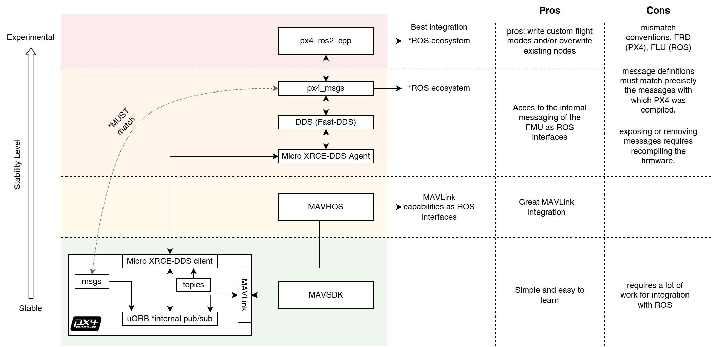

# Developers

This section of the documentation is intended for those who want to develop what we will from now on call "smart missions". This term "smart mission" will be used in the documentation to simply refer to missions that require additional capabilities beyond the flight controller capabilities on its own, which we will call "bare missions". 

For example, "bare mission" can be a mission programmed with QGroundControl where the drone follows a route or survey a certain area, so "bare mission" is any mission that uses the capabilities embedded in the flight controller, however in some use-cases these missions may lack more advanced capabilities such as detecting invasive plants and applying herbicide in a targeted manner, or performing autonomous navigation requiring depth and lidar processing. All of these examples cannot be executed on the flight controller directly, so a companion computer is needed to offload the processing of other types of sensors, this is where we refer to "smart missions" missions that can be orchestrated from the companion computer but at the same time are transparent to the flight controller and offer the ability to be composed into a mission that combines "bare" and "smart" functionalities.

## Prerequisites

- Familiarity with Ubuntu’s desktop environment. Recommendation [Linux Command Line and Shell Scripting Bible 4th Edition](https://www.wiley.com/en-us/Linux+Command+Line+and+Shell+Scripting+Bible%2C+4th+Edition-p-9781119700937) chapter 1 section "The Linux Desktop Environment".
- Proficiency with basic terminal commands (mainly bash). See chapter 3 and 4 of [Linux Command Line and Shell Scripting Bible 4th Edition](https://www.wiley.com/en-us/Linux+Command+Line+and+Shell+Scripting+Bible%2C+4th+Edition-p-9781119700937).
- Understand GNU/Linux file system.  [Linux Command Line and Shell Scripting Bible](https://www.wiley.com/en-us/Linux+Command+Line+and+Shell+Scripting+Bible%2C+4th+Edition-p-9781119700937) chapter 7 and 8.
- Python/C++ skills, including basic OOP concepts. For recap python check [Think Python 2nd Edition by Allen B. Downey](https://greenteapress.com/wp/think-python-2e/) for [C++ check Programming: Principles and Practice Using C++ 2nd Edition by Bjarne Stroustrup](https://jakevdp.github.io/PythonDataScienceHandbook/)
- Basics of VCS (Version control system) with git. My personal recommendation is the [Pro Git 2nd Edition by Scott Chacon and Ben Straub](https://git-scm.com/book/en/v2) chapter 1, 2, and 3.

## Brief Overview

|  |
|-----------------------------------------------------------------------|
| Brief system overview                                                 |

> [!IMPORTANT]  
> Some of the components we depend on are under development or are in an experimental state and maintained by third parties. Collaboration and contribution to improve them is highly recommended.
