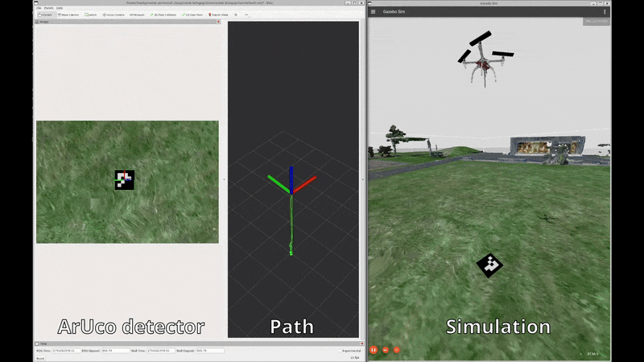
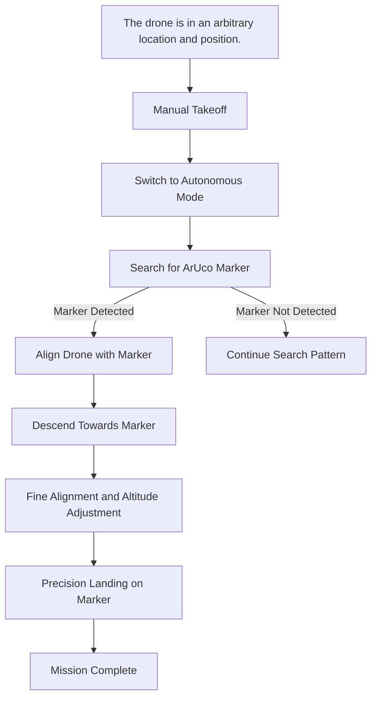

# Precision Landing (Assignment)



The purpose of this mini project is to familiarize yourself with the EOLab System and how ROS2 interplay with the PX4 ecosystem. 

In reality, a full-precision landing assignment requires knowledge and skills in computer vision for marker detection, search algorithms, path planning, pattern generation to survey for the marker, and drone controllability. But in order to minimize friction, this project focuses solely on the basics of “controllability” and has implemented only the minimum components for marker detection, deliberately omitting search and path generation.

## Execution Overview

The following diagram shows the expected execution workflow.



## System Start-Up

The EOLab system provides a set of predefined worlds, which can be specified during launch using the `world` argument. For this project, launch the world called `aruco`:

```
ros2 launch eolab_bringup start.launch.py world:=aruco
```

As mentioned in the introduction, a node is provided that handles detection and reports a set of results. To start the detector, you can run:

```
ros2 run eolab_precision_landing detector --ros-args -r __ns:=/protoflyer
```

Publishes:

| Topic                                          | Message type                                                                                                      |
|------------------------------------------------|-------------------------------------------------------------------------------------------------------------------|
| `/<PROVIDED NAMESPACE>/detected_aruco_markers` | [`visualization_msgs/MarkerArray`](https://docs.ros.org/en/jade/api/visualization_msgs/html/msg/MarkerArray.html) |
| `/<PROVIDED NAMESPACE>/aruco_debug_image`      | [`sensor_msgs/Image`](https://docs.ros.org/en/noetic/api/sensor_msgs/html/msg/Image.html)                         |

Subscribes:

| Topic                               | Message type                                                                                        |
|-------------------------------------|-----------------------------------------------------------------------------------------------------|
| `/<PROVIDED NAMESPACE>/camera_info` | [`sensor_msgs/CameraInfo`](https://docs.ros.org/en/noetic/api/sensor_msgs/html/msg/CameraInfo.html) |
| `/<PROVIDED NAMESPACE>/image`       | [`sensor_msgs/Image`](https://docs.ros.org/en/noetic/api/sensor_msgs/html/msg/Image.html)           |

As aditional information keep in mind that to control the drone you should publish the control command on:

| Topic                                            | Message type                                                                                              |
|--------------------------------------------------|-----------------------------------------------------------------------------------------------------------|
| `/<DRONE NAMESPACE>/fmu/in/manual_control_input` | [`px4_msgs::msg::ManualControlSetpoint`](https://docs.px4.io/main/en/msg_docs/ManualControlSetpoint.html) |
