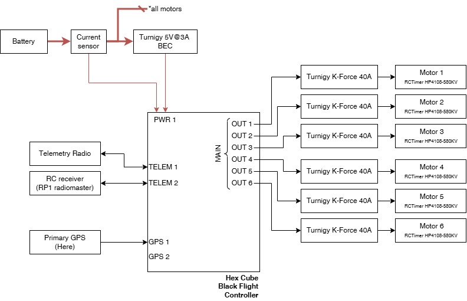

# Pegasus

## Specs

|                                                                    |                                        |
|--------------------------------------------------------------------|----------------------------------------|
| Airframe configuration                                             | Hexarotor X                            |
| Wheelbase diameter                                                 | 0.8 m                                  |
| Dry weight*                                                        | 2.9 kg                                    |
| Payload capacity                                                   | TBA                                    |
| Number of motors                                                   | 6                                      |
| Total recommended thrust (at 4S, Prop 10x4.7 (APC), 100% throttle) | 4.62 kfg (estimated from HP4108-480KV) |
| Max. Total thrust                                                  | TBA                                    |
| Number of batteries                                                | 1                                      |
| Battery voltage                                                    | 4S                                     |
| Battery capacity                                                   | TBA                                    |
| Individual battery weight                                          | TBA                                    |
| Max. flight time**                                                 | (to be measured) min                   |

*: Drone's weight without battery or payloads 
**: Without payload and hovering

## Components

| Component   | Model                                                                                                                  | Documentation                                                                                                                     |
|-------------|------------------------------------------------------------------------------------------------------------------------|-----------------------------------------------------------------------------------------------------------------------------------|
| Base Frame  | [Tarot T810 Hexa-Copter Carbon Kit](https://hobbyking.com/en_us/tarot-t810-hexa-copter-carbon-kit.html) (Discontinued) |                                                                                                                                   |
| FMU         | [Hex Cube Black](https://docs.px4.io/main/en/flight_controller/pixhawk-2.html)                                         | [The Cube Module Overview](https://docs.cubepilot.org/user-guides/autopilot/the-cube-module-overview)                             |
| Motor       | RCTimer HP4108-580KV (Discontinued)                                                                                    | The [RCTimer HP4108-480KV](https://www.rctimer.com/rctimer-hp4108-480kv-24n22p-multirotor-brushless-motor-p0253.html) is similar. |
| ESC         | [Turnigy K-Force 40A](https://hobbyking.com/de_de/turnigy-k-force-40a-brushless-esc.html) (Discontinued)               | [Specification section in the website](https://hobbyking.com/de_de/turnigy-k-force-40a-brushless-esc.html)                        |
| Props       | [APC SlowFly Prop 12x3.8 (Product Code: LP12038SF)](www.apcprop.com/product/12x3-8sf/) 12 inch.                        | Not found.                                                                                                                        |
| BEC         | [TURNIGY 3A UBEC](https://hobbyking.com/de_de/turnigy-3a-ubec-w-noise-reduction.html)                                  | [Specification section in the website](https://hobbyking.com/de_de/turnigy-3a-ubec-w-noise-reduction.html)                        |
| Primary GPS | Here GNSS (Discontinued) by Hex.aero and Proficnc                                                                      | [User manual](https://www.mybotshop.de/Datasheet/Here_GNSS_Pixhawk2.1.pdf)                                                        |

## Diagram

|   |
|--------------------------------------------|
| Connection Diagram for EOLab Phoenix Drone |
