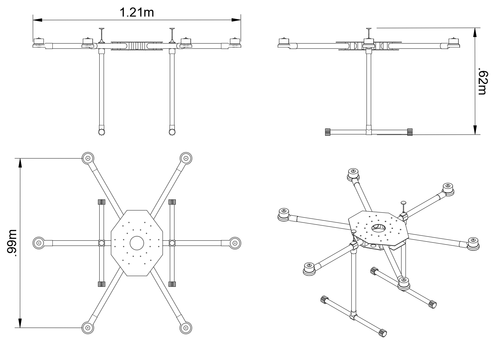
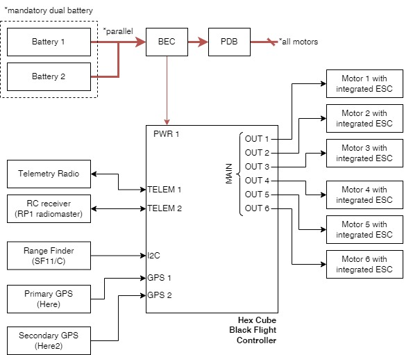

# Phoenix

## Specs

|                                                            |                                     |
|------------------------------------------------------------|-------------------------------------|
| Airframe configuration                                     | Hexarotor X                         |
| Wheelbase diameter                                         | 1.15 m                              |
| Dry weight*                                                | 5.5 kg                              |
| Payload capacity                                           | 15 kg                               |
| Number of motors                                           | 6                                   |
| Total recommended thrust (at 6S, Prop 20*6, 100% throttle) | 32 kfg (calculated from motor spec) |
| Max. Total thrust (at 6S, Prop 20*6, 100% throttle)        | 50 kfg (calculated from motor spec) |
| Number of batteries                                        | 2                                   |
| Battery voltage                                            | 6S (x2 parralel)                    |
| Battery capacity                                           | 10000 mAh                           |
| Individual battery weight                                  | 1.281 kg                            |
| Max. flight time**                                         | (to be measured) min                |

*: Drone's weight without battery or payloads 
**: Without payload and hovering

|  |
|-------------------------------------------------|
| Overall dimensions                              |

## Components

| Component     | Model                                                                                                                                                                                                                 | Documentation                                                                                                    |
|---------------|-----------------------------------------------------------------------------------------------------------------------------------------------------------------------------------------------------------------------|------------------------------------------------------------------------------------------------------------------|
| FMU           | [Hex Cube Black](https://docs.px4.io/main/en/flight_controller/pixhawk-2.html)                                                                                                                                        | [The Cube Module Overview](https://docs.cubepilot.org/user-guides/autopilot/the-cube-module-overview)            |
| Motor         | [T-Motor MN505-S KV320](https://store.tmotor.com/product/mn505-s-kv320-motor-navigator-type.html) (as part of [T-Motor 505-X Combo Pack](https://store.tmotor.com/product/505-x-standard-integrated-propulsion.html)) | [Specification section in the website](https://store.tmotor.com/product/mn505-s-kv320-motor-navigator-type.html) |
| ESC           | [T-Motor Alpha 60A 6S](https://store.tmotor.com/product/alpha-60a-6s-esc.html)                                                                                                                                        | [Specification section in the website](https://store.tmotor.com/product/alpha-60a-6s-esc.html)                   |
| Props         | [T-Motor MF2009](https://store.tmotor.com/product/mf2009-polymer-folding-prop.html) 20.4 inch                                                                                                                         | [Specification section in the website](https://store.tmotor.com/product/mf2009-polymer-folding-prop.html)        |
| Rangefinder   | [SF11/C](https://lightwarelidar.com/shop/sf11-c-100-m/) up to 100 meter range                                                                                                                                         | [Product Manual](https://www.documents.lightware.co.za/SF11%20-%20Laser%20Altimeter%20Manual%20-%20Rev%2010.pdf) |
| Primary GPS   | Here GNSS (Discontinued) by Hex.aero and Proficnc                                                                                                                                                                     | [User manual](https://www.mybotshop.de/Datasheet/Here_GNSS_Pixhawk2.1.pdf)                                       |
| Secondary GPS | Here2 (Discontinued) by Hex.aero and Proficnc                                                                                                                                                                         | [HEX/ProfiCNC Here2 GPS - PX4 Docs](https://docs.px4.io/main/en/gps_compass/gps_hex_here2.html)                  |

## Diagram

|   |
|--------------------------------------------|
| Connection Diagram for EOLab Phoenix Drone |

## Acknowledgment

*This drone was acquired from [Drone4Agro](https://drone4agro.com/en) (Winfried Rijssenbeek) by [EOLab](https://www.eolab.de/) (part of [Lab3](https://www.hochschule-rhein-waal.de/en/faculties/communication-and-environment/laboratories/lab3)) at [Hochschule Rhein-Waal (HSRW)](https://www.hochschule-rhein-waal.de) within the framework of the [Emergency Drone](https://deutschland-nederland.eu/en/projects/emergency-drone/) project, funded by the [Interreg Germany-Netherlands](https://deutschland-nederland.eu/en/) programme. See [Drohnen als Lebensretter im Katastrophenfall](https://deutschland-nederland.eu/de/drohnen-als-lebensretter-im-katastrophenfall/) for a short description of the project objective.*
